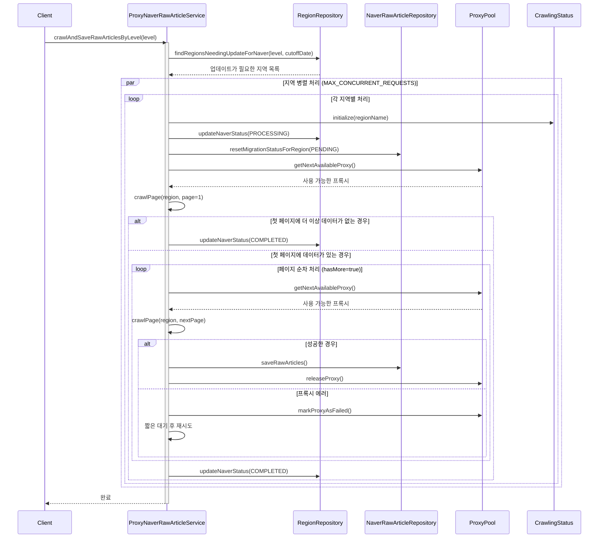

# ProxyNaverRawArticleService 개요

ProxyNaverRawArticleService는 네이버 부동산의 원본 매물 정보를 프록시를 통해 안정적으로 수집하여 원시 데이터 형태로 저장하는 서비스입니다. 이 문서는 서비스의 주요 흐름과 컴포넌트 간의 상호작용을 설명합니다.

## 시퀀스 다이어그램

## 주요 컴포넌트

* **ProxyNaverRawArticleService**: 네이버 부동산 원본 매물 정보 수집 서비스의 메인 컴포넌트
    * 지역별 원본 매물 정보 수집 프로세스 관리
    * 지역 간 병렬 처리 조정
* **ProxyPool**: 프록시 요청 처리 및 관리
    * 프록시 에러 감지 및 처리
    * 프록시 성능 모니터링 및 최적화
* **NaverRawArticleRepository**: 원본 매물 데이터 저장 담당
    * 마이그레이션 상태 관리

## 주요 처리 흐름

### 초기화

1.  특정 레벨의 지역 목록 조회
2.  지역 간 병렬 처리 시작 (최대 MAX_CONCURRENT_REQUESTS개 동시 처리)

### 지역별 처리

1.  지역 상태 초기화 및 업데이트 (PROCESSING)
2.  해당 지역의 기존 마이그레이션 상태 초기화 (PENDING)

### 페이지 처리

1.  첫 페이지 처리로 데이터 존재 확인
2.  첫 페이지에 더 이상 데이터가 없으면 바로 종료
3.  페이지 순차 처리 (hasMore=true인 동안 계속)

### 원본 데이터 저장

1.  수집된 원본 매물 정보를 JSON 문자열로 저장
2.  기존 매물은 업데이트하고 마이그레이션 상태 초기화
3.  새 매물은 새로 생성하여 저장

### 완료 처리

1.  지역 상태 업데이트 (COMPLETED 또는 FAILED)

## 에러 처리

### 프록시 에러

* 연결 타임아웃
* 네트워크 오류
* 빈 응답
    * → 다른 프록시로 자동 재시도

### 일반 에러

* 404 Not Found
* 잘못된 응답 형식
    * → 해당 페이지 스킵

### 최대 재시도 횟수 초과

* 프록시 최대 재시도 횟수 초과 시 예외 발생
* 지역 상태를 FAILED로 업데이트

## 데이터 저장 프로세스

### 원본 데이터 확인

* 매물 ID로 기존 데이터 확인
* 기존 데이터가 있으면 업데이트, 없으면 새로 생성

### 원본 데이터 저장

* 매물 ID: articleId
* 지역 코드: cortarNo
* 원본 데이터: rawData (JSON 문자열)
* 마이그레이션 상태: migrationStatus (PENDING)

### 마이그레이션 상태 관리

* 기존 데이터 업데이트 시 마이그레이션 상태 초기화
* 새 데이터 생성 시 마이그레이션 상태를 PENDING으로 설정

## 성능 최적화

### 병렬 처리

* 지역 간 병렬 처리 (최대 MAX_CONCURRENT_REQUESTS개 동시 처리)
* 프록시 풀 크기에 따라 동시 처리 지역 수 조정

### 프록시 관리

* 프록시 성능 모니터링 (응답 시간)
* 실패한 프록시 자동 제외
* 프록시 풀 자동 새로고침

### 리소스 관리

* 프록시 사용량 제어
* 지역 간 짧은 대기 시간 추가
* 페이지 처리 결과에 따라 대기 시간 동적 조정

## 차이점 (ProxyNaverArticleService와 비교)

### 저장 대상

* ProxyNaverArticleService: 가공된 매물 정보 (PropertyArticle)
* ProxyNaverRawArticleService: 원본 매물 정보 (NaverRawArticle)

### 데이터 형식

* ProxyNaverArticleService: 구조화된 필드로 분리하여 저장
* ProxyNaverRawArticleService: JSON 문자열 형태로 원본 데이터 저장

### 마이그레이션 상태

* ProxyNaverRawArticleService만 마이그레이션 상태 관리 기능 포함
    * 원본 데이터를 가공된 데이터로 변환하는 과정 추적
