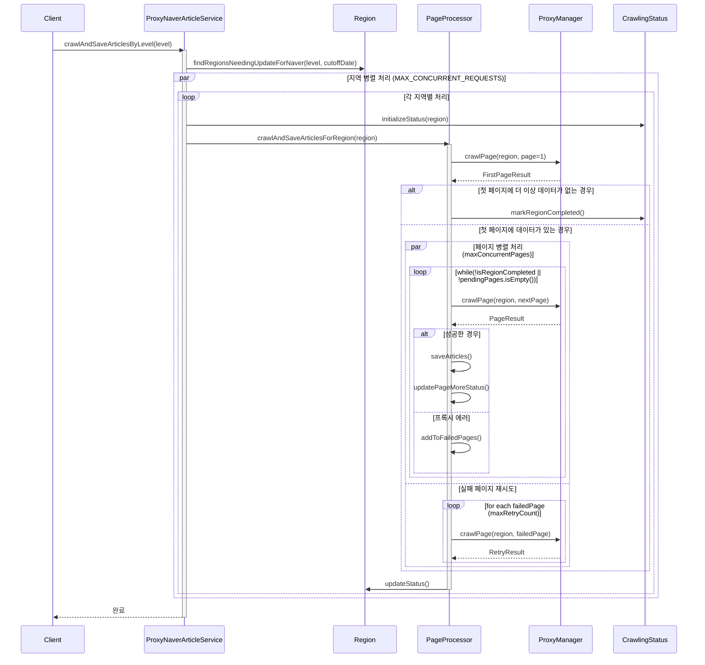

# ProxyNaverArticleService 흐름도

## 개요
ProxyNaverArticleService는 네이버 부동산의 매물 정보를 프록시를 통해 안정적으로 수집하는 서비스입니다. 
이 문서는 서비스의 주요 흐름과 컴포넌트 간의 상호작용을 설명합니다.

## 시퀀스 다이어그램

## 주요 컴포넌트

### ProxyNaverArticleService
- 네이버 부동산 매물 정보 수집 서비스의 메인 컴포넌트
- 지역별 매물 정보 수집 프로세스 관리
- 지역 간 병렬 처리 및 페이지 단위 병렬 처리 조정

### PageProcessor
- 개별 페이지 처리 로직 담당
- 실패한 페이지 재시도 관리
- 페이지 연속성 보장 메커니즘 구현

### ProxyManager
- 프록시 요청 처리 및 관리
- 프록시 에러 감지 및 처리
- 재시도 로직 구현

## 주요 처리 흐름

1. **초기화**
   - 특정 레벨의 지역 목록 조회
   - 지역 간 병렬 처리 시작 (최대 MAX_CONCURRENT_REQUESTS개 동시 처리)

2. **페이지 처리**
   - 첫 페이지 처리로 데이터 존재 확인
   - 첫 페이지에 더 이상 데이터가 없으면 바로 종료
   - 페이지 병렬 처리 시작 (최대 maxConcurrentPages개 동시 처리)
   - 실패한 페이지 재시도

3. **데이터 저장**
   - 수집된 매물 정보 저장
   - 지역 상태 업데이트

## 에러 처리

1. **프록시 에러**
   - 연결 타임아웃
   - 네트워크 오류
   - 빈 응답
   - → 자동 재시도

2. **일반 에러**
   - 404 Not Found
   - 잘못된 응답 형식
   - → 해당 페이지 스킵

3. **최대 재시도 횟수 초과**
   - 페이지 최대 재시도 횟수 초과 시 해당 페이지 스킵

## 페이지 연속성 보장

1. **페이지 상태 관리**
   - `pageMoreStatus`: 각 페이지의 more 상태 저장
   - `lastConfirmedPage`: 연속성이 확인된 마지막 페이지

2. **완료 조건**
   - 모든 페이지 처리 완료
   - 대기 중인 페이지 없음
   - 실패한 페이지 없음 또는 최대 재시도 횟수 초과

## 성능 최적화

1. **병렬 처리**
   - 지역 간 병렬 처리 (최대 MAX_CONCURRENT_REQUESTS개 동시 처리)
   - 페이지 단위 병렬 처리 (최대 maxConcurrentPages개 동시 처리)
   - 실패한 페이지 별도 스레드에서 재시도

2. **리소스 관리**
   - 프록시 사용량 제어
   - 메모리 사용 최적화
   - 처리 간격 자동 조정
   - 대기 중인 페이지가 없을 때만 짧은 대기 시간 추가 